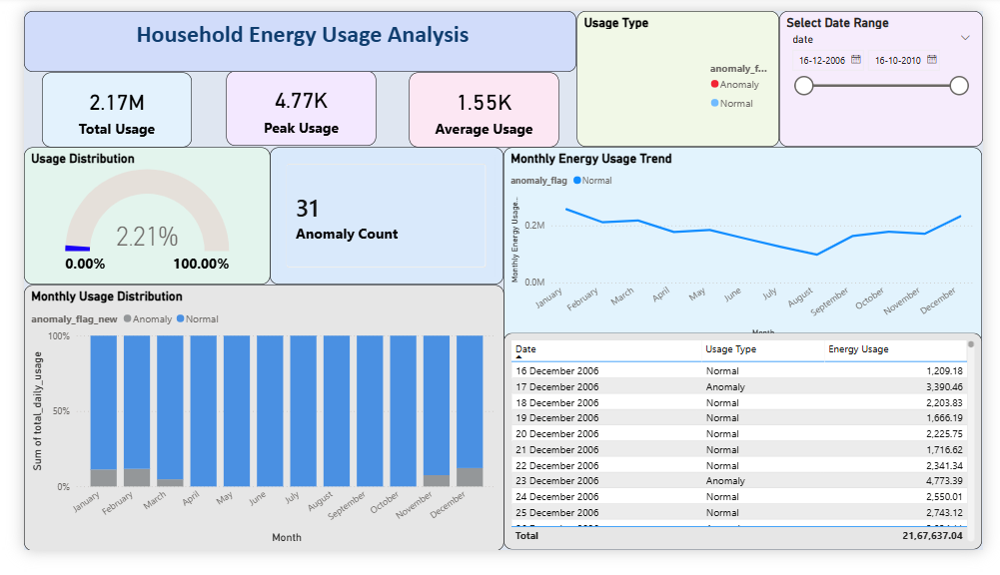
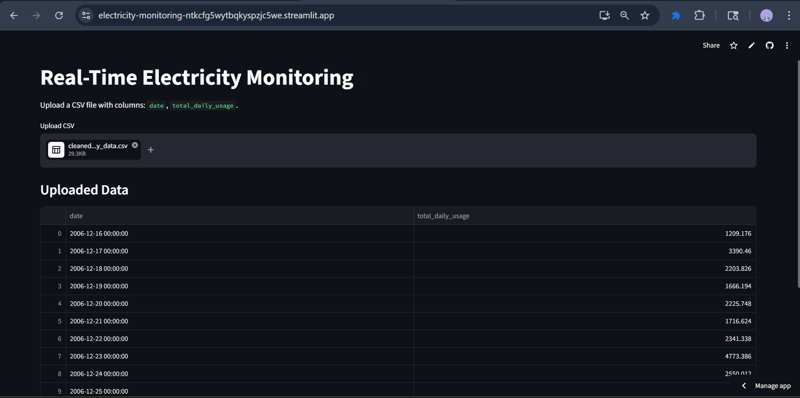
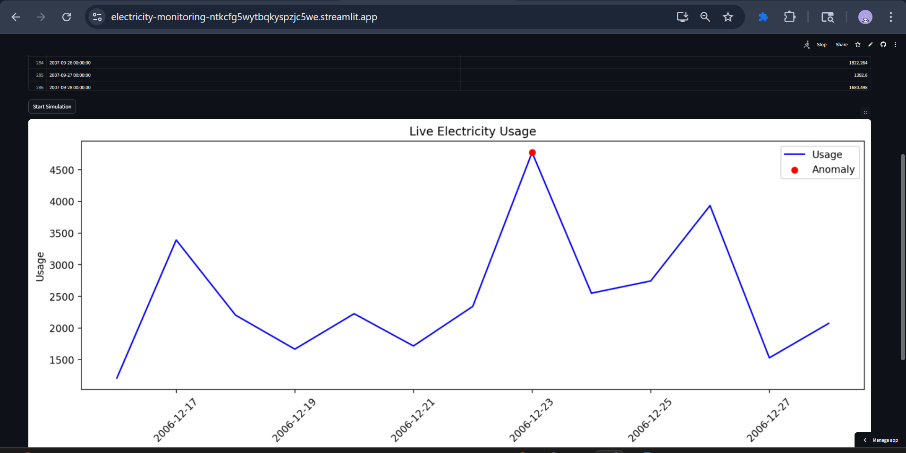
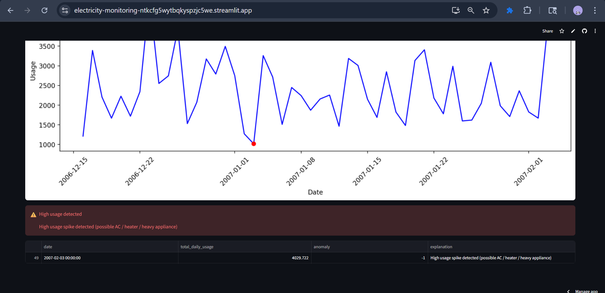

# ⚡ Real-Time Electricity Monitoring Dashboard

A web-based dashboard to analyze electricity consumption and detect anomalies using Machine Learning.

🔗 **Live App:** https://electricity-monitoring-ntkcfg5wytbqkyspzjc5we.streamlit.app

---

## 🚀 Features

* Upload CSV file with electricity usage data
* Interactive data visualization
* Real-time anomaly detection using Isolation Forest
* Displays total usage, average usage, and anomalies
* Clean and user-friendly interface

---

## 🛠 Tech Stack

* Python
* Streamlit
* Pandas
* Matplotlib
* Scikit-learn

---

## 📂 Input Format

CSV file should contain:

* `date`
* `total_daily_usage`

---

## 🤖 Machine Learning

* Uses **Isolation Forest Algorithm** for anomaly detection
* Identifies unusual electricity usage patterns

---

## 📈 Results / Insights

* Detects abnormal electricity usage
* Helps identify energy wastage
* Useful for smart energy monitoring systems

---

## 📊 Power BI Dashboard

* Visualizes electricity usage trends
* Highlights peak consumption periods
* Helps analyze anomalies



---

## 📷 App Screenshots







---

## ⚙️ How to Run Locally

```bash
pip install -r requirements.txt
streamlit run app.py
```

---

## 🎯 Future Improvements

* Add real-time alerts for anomalies
* Category-wise energy analysis
* Advanced data visualization
* AI-based energy saving suggestions

---

## 👩‍💻 Author
**Bavithra B**  
Final Year B.Tech IT Student  
🔗 GitHub: https://github.com/12bavithra
